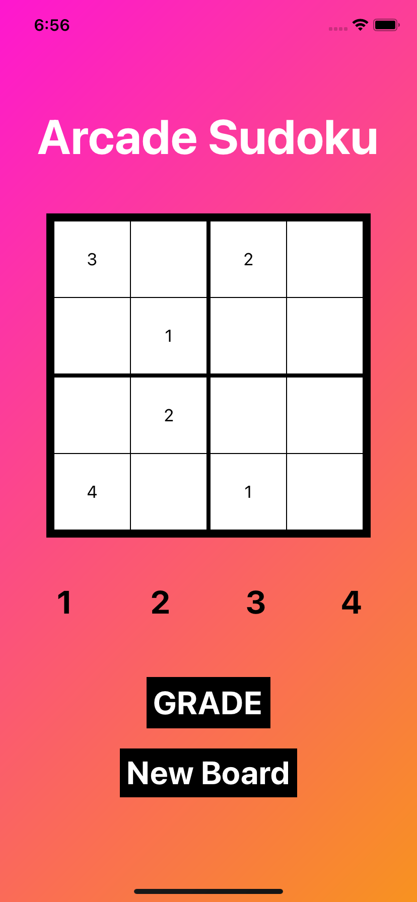
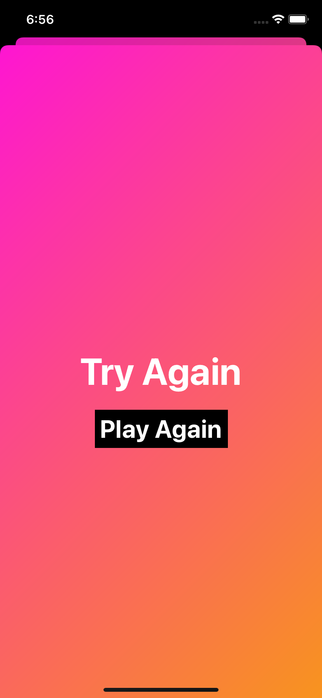
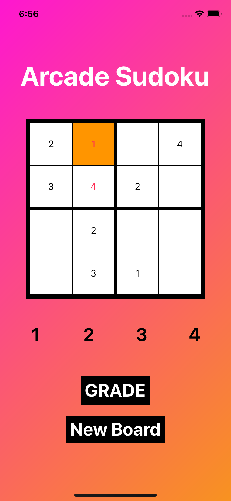

# Sudoku Arcade Style iOS-Application
A native iOS application built using Storyboard interface in Swift. Instead of the typical 9x9 Sudoku board, this is a arcadey variant where the games are short by utilizing a 4x4 board.

## How to Run
Requires a Mac
1) ```git clone https://github.com/vuongdennis/Sudoku-iOS```
2) Plug in iOS Device
3) Select device on Xcode
4) Run
5) Allow unauthorized developers on device
6) Launch Application

## The Board

The board is being constructed from an API call where the application receives partial data on the board.

## What does it do?
* Input Numbers
* Check Solution
* Reset the Board

<p float="left">


 </p>


