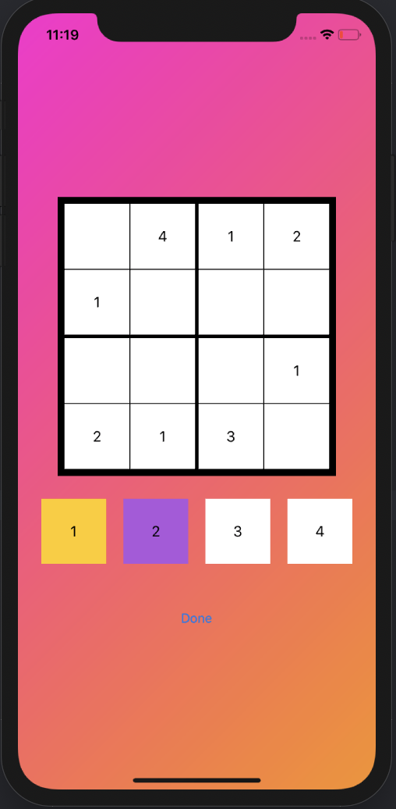
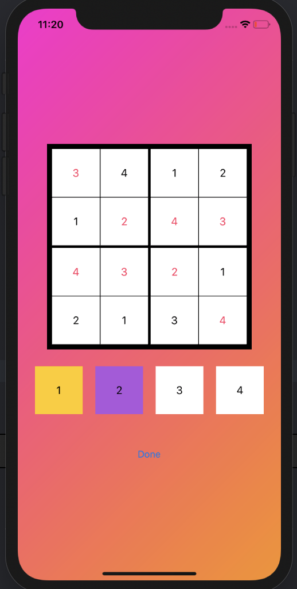

# Sudoku Arcade Style iOS-Application
This is a native iOS application built using Storyboard in Swift5. Instead of the typical 9x9 Sudoku board, this is a arcadey style of it where the games are short by utilizing a 4x4 board.

## The Board

The board is being made from an API where it varies from easy, medium and hard. 

## What does it do?
Right now, it can only create a Sudoku game board and see whether or not a user is able to solve it. 

In the future, I would like to add more functionality.

The Functionalities Include:
* Scoreboard Tracker
* Shop
  * Background Images
  * Different Color Selection Highlights
  * Different Sounds
* A fast arcade style timer where it sees how many boards a user can finish in a given time frame
